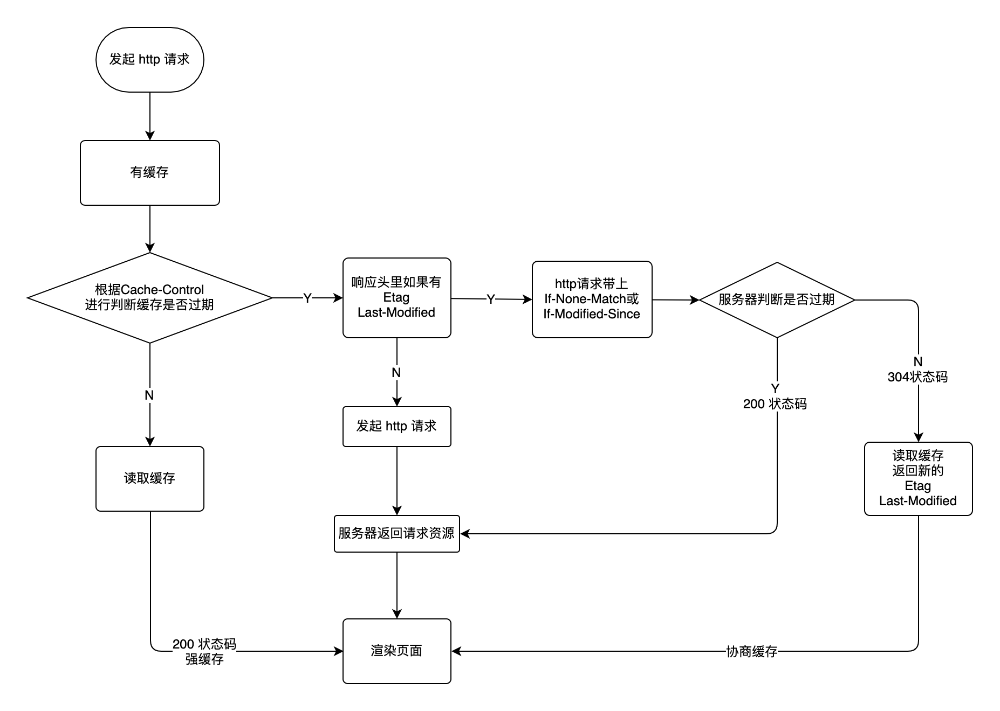

## 什么是缓存
通过复用以前获取的资源，可以显著提高网站和应用程序的性能。Web 缓存减少了等待时间和网络流量，因此减少了显示资源表示形式所需的时间。通过使用 HTTP缓存，变得更加响应性。

### 强制缓存

浏览器 <=== 本地缓存 ===> 服务器

Cache-Control：服务端控制

-  response headers 中
- 控制强制缓存的逻辑
- 例如 Cache-Control:max-age=3153600（单位是秒--一年）
- max-age 控制缓存的有效日期
- no-cache 不用强制缓存，不管服务端处理
- no-store 不用本地缓存，也不用服务端缓存
- private 该响应是专用于某单个用户的，中间人不能缓存此响应，该响应只能应用于浏览器私有缓存中。
- public 该响应可以被任何中间人（译者注：比如中间代理、CDN等）缓存。

Expires

- 同在 response headers 中
- 同为控制缓存过期
- 已被 Cache-Control 代替

### 协商缓存（对比缓存）

- 服务端缓存策略，服务端判断该资源能不能被缓存。
- 服务端判断客户端资源，是否和服务端一致
- 一致则返回304，否返回200和最新的资源

资源标识

- 在 response headers 中
- Last-Modified 资源最后修改的时间
   - 初次请求，服务端返回资源和 Last-Modified
   - 再次请求的时候，request headers 带着 If-Modified-Since（与 Las-Modified 相同）
   - 返回304，或者返回资源和新的 Last-Modified 
- Etag 资源的唯一标识（一个字符串，类似人类的指纹 ）
   - 同上，只是 换成了 Etag，对应的请求头应该为 If-None-Match
- 会优先使用 Etag
- Last-Modified 只能精确到秒级
- 如果资源被重新生成，而内容不变，则Etag更精确

## 缓存总结图

## 页面刷新操作

- 正常操作：强制缓存有效，协商缓存有效
- 手动刷新：强制缓存失效，协商缓存失效
- 强制刷新：强制缓存失效，协商缓存失效

