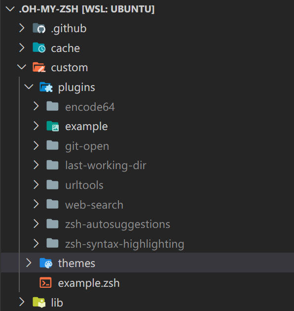

## 前置条件

zsh 只支持 类unix系统，不支持windows，windows用户想要体验，请在WSL中尝试！

## 安装

### zsh安装

- 首先安装 Z shell，通过 `zsh --version` 判断是否安装
- 安装 Z shell `sudo apt install zsh`
- 设置为默认的bash `chsh -s $(which zsh)` 然后重启终端通过 `echo $SHELL` 确认默认终端（这个不一定有用，可能已经默认成功但是还是显示的 bash）

### oh my zsh安装

两种安装方式：

- `via curl`

```bash
sh -c "$(curl -fsSL https://raw.githubusercontent.com/robbyrussell/oh-my-zsh/master/tools/install.sh)"
```

- `via weget`

```bash
sh -c "$(wget https://raw.githubusercontent.com/robbyrussell/oh-my-zsh/master/tools/install.sh -O -)"
```

### PowerLine Fonts安装

大部分主题都需要这个字体的支持：

&ensp;&ensp;ubuntu安装 `sudo apt-get install fonts-powerline`

在WSL安装，需要把字体安装在windows系统中:

1. `git clone https://github.com/powerline/fonts.git --depth=1`
1. 然后双击 `install.ps1` 文件自动安装字体，通过 `powershell` 运行脚本进行安装
1. 在不同的终端中配置字体，选择一款 for Powerline 的字体即可

## 主题配置

- 默认主题都在 `./oh-my-zsh/thems` 目录下
- 新增的主题应该拷贝主题文件,以 `.zsh-theme` 结尾的文件，放在 `.oh-my-zsh/custom/themes` 目录下

### 修改主题配置

有时候别人的不总是满足，需要我们自定义一下

- 修改命令行前缀, 主题文件里的，比如主题 `bullet-train.zsh-theme` 文件里的 `Define order and content of prompt` 就定义了命令行前缀的一些命名，修改对应模块下的函数就可以改变命名。

## 插件

### 安装插件

- 通过包管理模式： `apt-get install` 的方式导入插件
- 通过 `git clone` 的方式拷贝代码到 `.oh-my-zsh/custom/plugins` 目录。

然后在 `.zshrc` 文件里 `plugins = (git zsh-autosuggestion)` 加入对应的插件

### 常用插件

具体的安装方式请查看插件的github：

- zsh-autosuggestion 路径自动补全
- zsh-syntax-highlighting 命令语法高亮
- [常见git缩写命令](https://github.com/robbyrussell/oh-my-zsh/wiki/Plugin:git)
- git-open打开远程仓库
- web-search 直接在命令行搜索，例如： `google node` 会自动打开Google搜索node
- last-working-dir 打开终端时自动为上次退出时的目录(zsh 自带插件)
  - 注意：在 windows10 wsl 中，这个插件判断当前为 $HOME 则不会进行跳转，所以需要在 wsl 中设置一个启动目录非 $HOME 的，比如 ~ 目录
- encode base64编码转化插件
- urltools 使用urlcode命令对url进行编码
- wd 给常用文件目录标记，快速跳转到指定目录，比如：进入目录后, wd add web，该目录被标记成web，下次直接 wd web就可以进入到该目录。直接在配置文件里添加

### linux自带插件

- autojump 实现快速跳转到目录，安装后查看 `/usr/share/doc/autojump/README.Debian` 文件进行配置，其实就是（zsh）将  `. /usr/share/autojump/autojump.sh` 写入 `.zshrc` (注意空格)
- bat代替cat，有语法高亮
   1. ubuntu 系统建议采用 `.deb` packages 方式安装
   1. 从 github 下载 [bat 最新的安装包](https://github.com/sharkdp/bat/releases/download/v0.15.4/bat_0.15.4_amd64.deb) ，建议直接网页下载，然后copy到 wsl 。（注：apt-get 方式ubuntu 软件源有重名问题，需要软连接一下，会出问题，故没有采用。下载.deb 软件包，最好在windows 网页下载，curl 方式下载的包有问题。）
   1. 执行 `sudo dpkg -i bat_0.15.4_amd64.deb` 进行安装

## 文件配置

### .OH_MY_ZSH文件目录



### .zshrc 文件

```bash
# If you come from bash you might have to change your $PATH.
# export PATH=$HOME/bin:/usr/local/bin:$PATH

# autojump setting
. /usr/share/autojump/autojump.sh

# Path to your oh-my-zsh installation.
export ZSH="/home/xiaomu/.oh-my-zsh"

# Set name of the theme to load --- if set to "random", it will
# load a random theme each time oh-my-zsh is loaded, in which case,
# to know which specific one was loaded, run: echo $RANDOM_THEME
# See https://github.com/ohmyzsh/ohmyzsh/wiki/Themes
ZSH_THEME="robbyrussell"

# Set list of themes to pick from when loading at random
# Setting this variable when ZSH_THEME=random will cause zsh to load
# a theme from this variable instead of looking in $ZSH/themes/
# If set to an empty array, this variable will have no effect.
# ZSH_THEME_RANDOM_CANDIDATES=( "robbyrussell" "agnoster" )

# Uncomment the following line to use case-sensitive completion.
# CASE_SENSITIVE="true"

# Uncomment the following line to use hyphen-insensitive completion.
# Case-sensitive completion must be off. _ and - will be interchangeable.
# HYPHEN_INSENSITIVE="true"

# Uncomment the following line to disable bi-weekly auto-update checks.
# DISABLE_AUTO_UPDATE="true"

# Uncomment the following line to automatically update without prompting.
# DISABLE_UPDATE_PROMPT="true"

# Uncomment the following line to change how often to auto-update (in days).
# export UPDATE_ZSH_DAYS=13

# Uncomment the following line if pasting URLs and other text is messed up.
# DISABLE_MAGIC_FUNCTIONS=true

# Uncomment the following line to disable colors in ls.
# DISABLE_LS_COLORS="true"

# Uncomment the following line to disable auto-setting terminal title.
# DISABLE_AUTO_TITLE="true"

# Uncomment the following line to enable command auto-correction.
# ENABLE_CORRECTION="true"

# Uncomment the following line to display red dots whilst waiting for completion.
# COMPLETION_WAITING_DOTS="true"

# Uncomment the following line if you want to disable marking untracked files
# under VCS as dirty. This makes repository status check for large repositories
# much, much faster.
# DISABLE_UNTRACKED_FILES_DIRTY="true"

# Uncomment the following line if you want to change the command execution time
# stamp shown in the history command output.
# You can set one of the optional three formats:
# "mm/dd/yyyy"|"dd.mm.yyyy"|"yyyy-mm-dd"
# or set a custom format using the strftime function format specifications,
# see 'man strftime' for details.
# HIST_STAMPS="mm/dd/yyyy"

# Would you like to use another custom folder than $ZSH/custom?
# ZSH_CUSTOM=/path/to/new-custom-folder

# Which plugins would you like to load?
# Standard plugins can be found in $ZSH/plugins/
# Custom plugins may be added to $ZSH_CUSTOM/plugins/
# Example format: plugins=(rails git textmate ruby lighthouse)
# Add wisely, as too many plugins slow down shell startup.
plugins=(git zsh-autosuggestions zsh-syntax-highlighting git-open web-search last-working-dir encode64 urltools wd)

source $ZSH/oh-my-zsh.sh

# User configuration

# export MANPATH="/usr/local/man:$MANPATH"

# You may need to manually set your language environment
# export LANG=en_US.UTF-8

# Preferred editor for local and remote sessions
# if [[ -n $SSH_CONNECTION ]]; then
#   export EDITOR='vim'
# else
#   export EDITOR='mvim'
# fi

# Compilation flags
# export ARCHFLAGS="-arch x86_64"

# Set personal aliases, overriding those provided by oh-my-zsh libs,
# plugins, and themes. Aliases can be placed here, though oh-my-zsh
# users are encouraged to define aliases within the ZSH_CUSTOM folder.
# For a full list of active aliases, run `alias`.
#
# Example aliases
# alias zshconfig="mate ~/.zshrc"
# alias ohmyzsh="mate ~/.oh-my-zsh"

```
